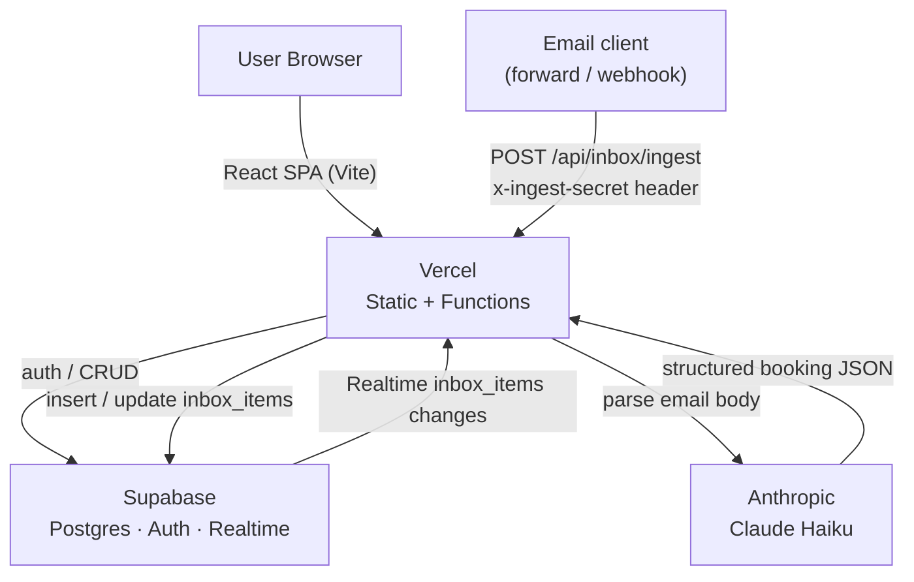

# Travel OS

A personal trip-management app — pipeline, inbox, calendar, budget, packing, and documents all in one place.

## Features

- **Pipeline** — Kanban board moving trips through Dreaming → Planning → Booked → Upcoming → Archived
- **Trip detail tabs** — Overview, Itinerary, Bookings, Budget, Packing, Documents, Notes per trip
- **Inbox** — captures forwarded booking confirmation emails and suggests trip assignments
- **Calendar** — month view showing all trip date ranges at a glance
- **Add Trip wizard** — 3-step modal: destination, categories/travelers, dates/budget
- **Theming** — light/dark mode, 5 accent colors (Clay, Olive, Ink, Plum, Sand), 3 density levels

## Tech stack

| Layer | Technology |
|---|---|
| UI | React 18 + TypeScript (strict) |
| Build / dev server | Vite 5 |
| Routing | React Router v6 |
| Backend | Supabase (Postgres + magic-link auth + Realtime) |
| AI | Anthropic Claude Haiku (email parsing via `@anthropic-ai/sdk`) |
| Unit tests | Vitest + Testing Library (100% branch coverage enforced) |
| E2E / visual tests | Playwright (Chromium, with screenshot regression) |
| Styling | Vanilla CSS with design-token variables |
| Deployment | Vercel |

## Prerequisites

- Node.js ≥ 20
- A [Supabase](https://supabase.com) account
- An [Anthropic](https://console.anthropic.com) account (for the email ingestion API)
- A [Vercel](https://vercel.com) account (for deployment)

## Service setup

### 1. Supabase

Supabase provides the database, authentication, and real-time subscriptions.

1. Go to [supabase.com](https://supabase.com) and create a new project.
2. Once provisioned, open **Authentication → Providers** and ensure **Email** is enabled (magic-link / OTP — no password required).
3. Open **Settings → API** and copy:
   - **Project URL** → `VITE_SUPABASE_URL` and `SUPABASE_URL`
   - **anon / public key** → `VITE_SUPABASE_ANON_KEY`
   - **service_role key** → `SUPABASE_SERVICE_ROLE_KEY` (keep this secret — it bypasses row-level security)
4. Run the database migrations in `supabase/migrations/` against your project (via the Supabase CLI or the SQL editor in the dashboard).
5. In **Realtime → Tables**, make sure `inbox_items` is enabled for broadcasts so the UI receives live updates.

### 2. Anthropic

Claude Haiku parses forwarded booking emails into structured data.

1. Sign in at [console.anthropic.com](https://console.anthropic.com).
2. Go to **API Keys** and create a new key.
3. Copy the key → `ANTHROPIC_API_KEY`.

### 3. Vercel (deployment)

1. Import the repository in the [Vercel dashboard](https://vercel.com/new).
2. Set the **Root Directory** to `.` (the repo root) — Vite and the API functions are both configured from `vite.config.ts` and `vercel.json`.
3. Add all environment variables from the table below in **Settings → Environment Variables**.
4. Deploy. Vercel automatically routes `apps/web/api/**` as serverless functions.

To send a test email to the ingest endpoint after deploying:

```bash
curl -X POST https://<your-vercel-domain>/api/inbox/ingest \
  -H "Content-Type: application/json" \
  -H "x-ingest-secret: <INGEST_SECRET>" \
  -d '{
    "userId": "<supabase-user-uuid>",
    "raw": {
      "subject": "Your flight confirmation",
      "from": "bookings@airline.com",
      "receivedAt": "2026-04-25",
      "text": "Flight AA123 JFK→LAX confirmed for 2 May 2026."
    }
  }'
```

## Local setup

```bash
git clone <repo-url>
cd travel-os
npm install
cp .env.example .env   # fill in your credentials (see Environment variables below)
npm run dev
```

Open [http://localhost:5173](http://localhost:5173) and sign in with your email via magic link.

On first login the app seeds fixture trips, bookings, and inbox items so you have something to explore immediately.

## Environment variables

### Client-side (Vite)

| Variable | Description |
|---|---|
| `VITE_SUPABASE_URL` | Your Supabase project URL |
| `VITE_SUPABASE_ANON_KEY` | Your Supabase anonymous (public) key |

Both values are available in your Supabase project under **Settings → API**.

### Server-side (email ingestion API)

| Variable | Description |
|---|---|
| `SUPABASE_URL` | Your Supabase project URL (server-side, without `VITE_` prefix) |
| `SUPABASE_SERVICE_ROLE_KEY` | Supabase service-role key — bypasses RLS; keep secret |
| `ANTHROPIC_API_KEY` | Anthropic API key used by Claude Haiku to parse emails |
| `INGEST_SECRET` | Arbitrary secret sent in `x-ingest-secret` header to authenticate ingest requests |

`SUPABASE_SERVICE_ROLE_KEY` and `ANTHROPIC_API_KEY` are available in your Supabase project (**Settings → API**) and [Anthropic Console](https://console.anthropic.com) respectively.

## Scripts

| Command | What it does |
|---|---|
| `npm run dev` | Vite dev server with hot reload |
| `npm run build` | TypeScript check + Vite build → `dist/` |
| `npm run lint` | ESLint over `apps/web/src` |
| `npm test` | Vitest with v8 coverage (100% required, fails CI if below) |
| `npm run test:watch` | Vitest in watch mode |
| `npm run test:e2e` | Playwright integration + visual tests (Chromium) |
| `npm run test:e2e:ui` | Playwright in interactive UI mode |

### Playwright quick-start

Install the browser once:

```bash
npx playwright install chromium
```

Run all e2e tests:

```bash
npm run test:e2e
```

Regenerate visual baselines after an intentional UI change:

```bash
npx playwright test --update-snapshots e2e/visual/
```

Commit the updated PNGs in `e2e/__snapshots__/` as part of the same PR.

> **Note:** `VITE_E2E_BYPASS_AUTH=true` is injected automatically by the Playwright `webServer` config so tests can reach app routes without Supabase credentials. This variable is gated by `import.meta.env.DEV` and is dead-code eliminated in production builds — it cannot exist in a deployed bundle.

## Architecture

### Diagram



### Code layout

```
apps/web/
  src/
    app/         — AppLayout, AppContext (all global state), router, Login
    components/  — PipelineDashboard, InboxDashboard, CalendarDashboard,
                   ArchiveDashboard, TripCard, modals/, …
    lib/         — types.ts, db.ts (Supabase CRUD + Realtime), data.ts (fixtures), utils.ts
  api/
    inbox/
      ingest.ts  — POST /api/inbox/ingest (Claude-powered email parsing)
```

All state lives in `AppContext`. Every mutation flows through `AppContext` actions → `lib/db.ts` → Supabase. Components read state via the `useApp()` hook and never manage trip data locally.

The `api/inbox/ingest.ts` endpoint runs server-side on Vercel Functions. It accepts a forwarded email, creates a placeholder inbox item, calls Claude Haiku to extract booking details, and updates the item with parsed data or marks it `needs_review` if confidence is below 0.5. The inbox subscribes to Supabase Realtime so the UI updates automatically when items are inserted or updated.

## Development workflow

See [CLAUDE.md](CLAUDE.md) for the full TDD red → green → refactor cycle, 100% coverage requirement, issue/PR conventions, and commit message format.
